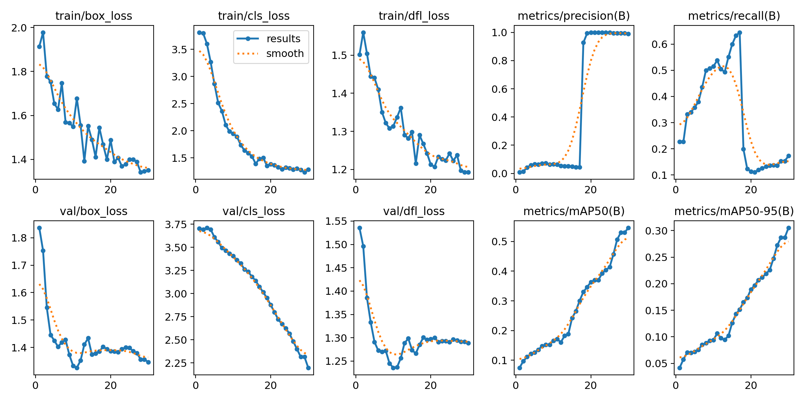
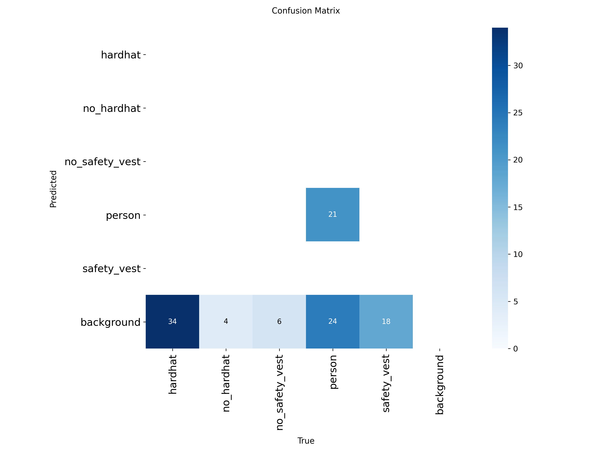
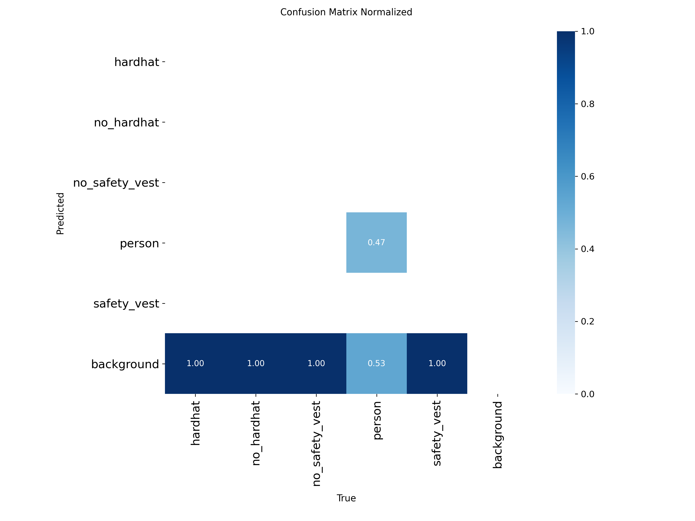

# M4T3_yolo_aeco
M4T3 - YOLOv8 AECO prototype (reproducible in Colab)
## Results (YOLOv8n)

**Dataset:** 60 images (train 48 / valid 12), imgsz 640, epochs 30  
**Classes:** person, hardhat, safety_vest, no_hardhat, no_safety_vest

**Validation metrics:**
- Precision: **0.9884**
- Recall: **0.1728**
- mAP@0.50: **0.5371**
- mAP@0.50:0.95: **0.3047**

**Interpretation:** High precision but low recall (small dataset + PPE objects are small/occluded + class imbalance). Improvements: add more labeled PPE examples per class, balance positives/negatives, and try yolov8s or more epochs.
### Training curves

### Confusion matrix

